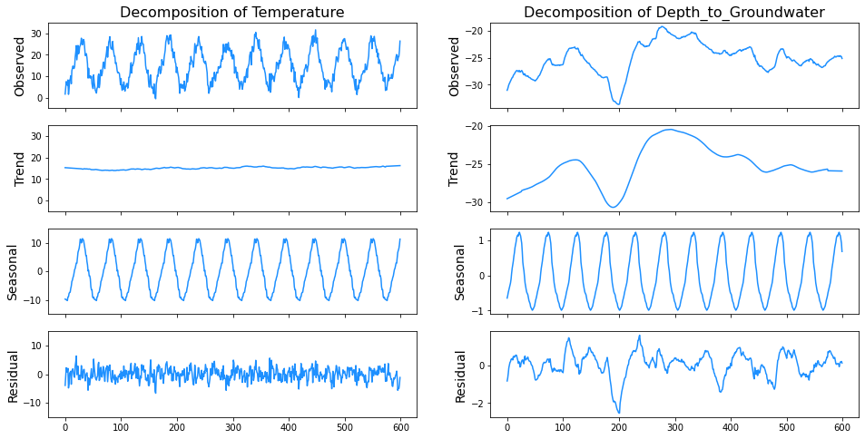
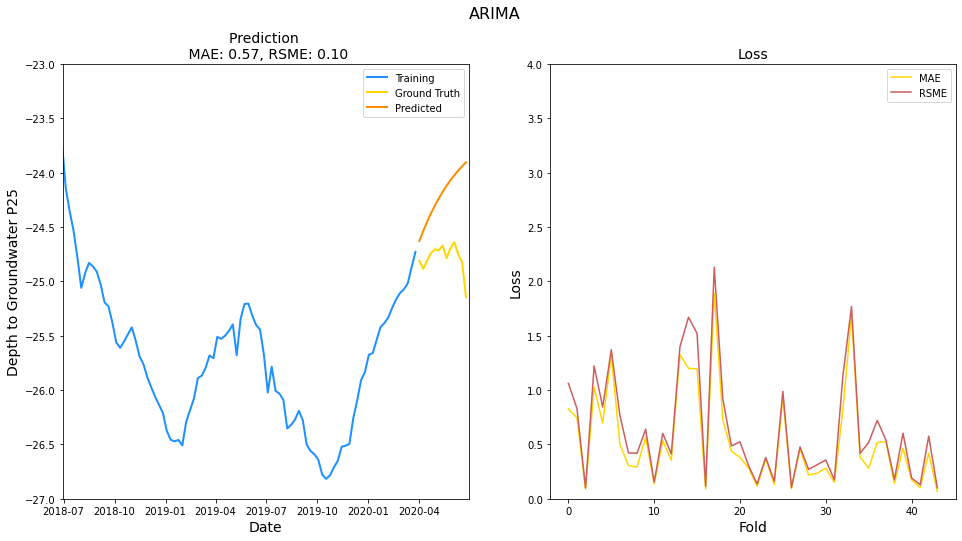

# DSLIB - A library for data cleaning and modelling

This library aims to provide a consistent interface, and
some automation for data science projects. This library
also features advanced algorithms like DBSCAN.

## Introduction

For EDA and data engineering, the functions are divided into four parts:

- `preprocessing.py`: Basic wrangling and time parsing
- `univariate.py`: Functions for univariate statistics
- `bivariate.py`: Functions for bivariate statistics
- `cleaning.py`: Functions for data cleaning
- `timeseries.py`: Funtions for time series analysis and visualization

The explaination for each function may be found in their respective doc string.

## Showcase

### Display Statistics

|index|ADF Statistic|p-value|5% Critical Value|
|---|---|---|---|
|Rainfall|-3\.374|0\.012|-2\.867|
|Temperature|-12\.034|0\.0|-2\.867|
|Drainage\_Volume|-3\.01|0\.034|-2\.866|
|River\_Hydrometry|-4\.824|0\.0|-2\.866|
|Depth\_to\_Groundwater|-2\.88|0\.048|-2\.866|


### Visualization


acf.png)


## Usual Pipeline

1. Read in the data, do basic wrangling and time parsing
2. Look at univariate statistics, identify low count groups, numeric outliers, and class imbalance problems
3. Look at colinearity and bivariate statistics, decide which features to keep and which features to drop (especially when handling missing data)
4. Deal with missing data, dummy encoding, and scaling
5. Clean outliers.

## About Statistics

For bivariate statistics,

| Label Data Type | Feature Data Type | Effect size stat    | Visualization |   
|-----------------|-------------------|---------------------|---------------|
| Numeric         | Numeric           | Pearson Correlation | Scatterplot   |   
| Numeric         | Categorial        | One-way ANOVA       | Bar Chart     |   
| Categorial      | Categorial        | Pearson Chi-Square  | CrossTab      |

For a Pearson Correlation to be validly interpreted, there are three assumptions that must be met.

- Continuous Data
- Linear Relationship
- Homoskedastic Relationship

There are some assumptions concerning valid ANOVAs and t-tests:

- Normal distrubution of the numeric variable for each group of the categorial variable
- Equal variance of the numeric variable for each group of the categorial variable (variance = sqrt of std)
- The data used to carry out the analyses were sampled independently between groups

## About Modelling

After data engineering and cleaning, we try to build models.

Common Methods:

A. Linear Models
- Linear Regression, Logistic Regression
- Regularization (Ridge, Lasso)

Linear Models has the best interpretability since we can see the coefficients.

B. Tree-based Models
- Decision Trees
- Random Forests
- AdaBoost, GradientBoosting, XGBoost

For decision trees we can plot the tree out to see each decision so they are very interpretable. The interprebility goes down with the list but they all give an estimation of the importance of each feature.

### Usual Ensemble Methods

- Bagging: The trees are grown independently on random samples of the observations (Bootstrapping). In Random Forests, each split on each tree is performed using a random subset of the features, thereby decorrelating the trees.

- Boosting: We only use the original data and do not draw random samples. The trees are grown successively, with each new tree is fit to the residuals that is left over from the earlier trees, and shrunken down by the learning rate before it is used.

### Comparison between boosting models

|                   | AdaBoost | GradientBoosting | XGBoost |
| ----------------- | -------- | ---------------- | ------- |
| Speed/Scalability | Fast     | Moderate         | Fast    |
| Memory Usage      | Low      | Moderate         | Moderate|

AdaBoost: It builds a lot of weak learners (stumps) sequentially, and the amount of say of each stump is determined by its error. The sample weight is also scaled by the error, so that the stumps made after take the previous stumps' mistakes into account.

GradientBoosting: It starts with a single leaf. Then we produce shallow trees to estimate the residuals of the previous predictions. Each time we build a new tree based on the residuals, we scale the result of that tree by the learning rate, i.e. each time we take small steps into the right direction.

### Example: Classification

```python
models = [
    DecisionTreeClassifier(),
    RandomForestClassifier(),
    AdaBoostClassifier(),
    GradientBoostingClassifier(),
    #LogisticRegression()
]

scoring = ['accuracy','precision', 'recall', 'f1']

results = pd.DataFrame(columns = ['test_accuracy', 'test_precision', 'test_recall', 'test_f1'])

for model in models:
  cv_results = cross_validate(model, X, y, scoring=scoring, cv=5, return_train_score=True)
  results.loc[model.__class__.__name__] = [cv_results['test_accuracy'].mean(),
                                           cv_results['test_precision'].mean(),
                                           cv_results['test_recall'].mean(),
                                           cv_results['test_f1'].mean()]
```

### Example: Regression

```
models = [
    DecisionTreeRegressor(),
    RandomForestRegressor(),
    AdaBoostRegressor(),
    GradientBoostingRegressor()
]

scoring = ['neg_mean_squared_error', 'neg_mean_absolute_error']

results = pd.DataFrame(columns = ['test_mse', 'test_mae'])

for model in models:
  cv_results = cross_validate(model, X, y, scoring=scoring, cv=5, return_train_score=True)
  results.loc[model.__class__.__name__] = [cv_results['test_neg_mean_squared_error'].mean(),
                                           cv_results['test_neg_mean_absolute_error'].mean(),
                                           ]
```

### Draw out the decision tree

```python
dtr = DecisionTreeClassifier(ccp_alpha=0.01, max_depth=4)
dtr.fit(X, y)
fig = plt.figure(figsize=(25,20))
_ = plot_tree(dtr,
              feature_names=X.columns,
              filled=True,
              fontsize=12)
```

### Draw evaluation diagrams

```python
results = pd.DataFrame(columns=['ccp_alpha', 'test_accuracy', 'test_precision', 'test_recall', 'test_f1'])
alpha = [i * (0.016/30) for i in range(0, 30)]
accuracy = []
precision = []
recall = []
f1 = []
for ccp_alpha in alpha:
  dtc = DecisionTreeClassifier(ccp_alpha=ccp_alpha)
  cv_results = cross_validate(dtc, X, y, scoring=scoring, cv=5, return_train_score=True)
  accuracy.append(cv_results['test_accuracy'].mean())
  precision.append(cv_results['test_precision'].mean())
  recall.append(cv_results['test_recall'].mean())
  f1.append(cv_results['test_f1'].mean())

results['ccp_alpha'] = alpha
results['test_accuracy'] = accuracy
results['test_precision'] = precision
results['test_recall'] = recall
results['test_f1'] = f1

sns.lineplot(data = results.melt(['ccp_alpha']), x = 'ccp_alpha', y = 'value', hue = 'variable')
```

### Display Feature Importance

```
df_importance = pd.DataFrame(model.feature_importances_, columns=['Importance'])
df_importance['Feature'] = X.columns
df_importance= df_importance.sort_values(by=['Importance'], ascending=False)
sns.barplot(data=df_importance.head(20), x='Feature', y='Importance')
plt.xticks(rotation=90)
plt.show()
```

### ARIMA Model

```python
  from statsmodels.tsa.arima.model import ARIMA

  score_mae = []
  score_rsme = []

  for fold, valid_quarter_id in enumerate(range(2, N_SPLITS)):
      train_index = df[df.quarter_idx < valid_quarter_id].index
      valid_index = df[df.quarter_idx == valid_quarter_id].index

      y_train, y_valid = y.iloc[train_index], y.iloc[valid_index]
      
      model = ARIMA(y_train, order=(1,1,1))
      model_fit = model.fit()
      
      y_valid_pred = model_fit.predict(valid_index[0], valid_index[-1])

      score_mae.append(mean_absolute_error(y_valid, y_valid_pred))
      score_rsme.append(math.sqrt(mean_squared_error(y_valid, y_valid_pred)))


  model = ARIMA(y, order=(1,1,1))
  model_fit = model.fit()

  y_pred = model_fit.predict(y.index[-1]+1, y.index[-1] + len(y_test)).reset_index(drop=True)
  plot_approach_evaluation(y_pred, score_mae, score_rsme, 'ARIMA')
```